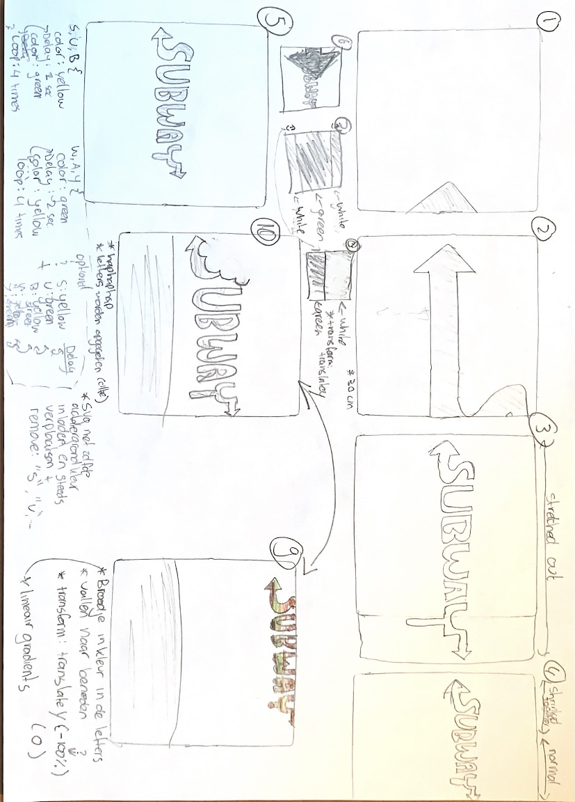
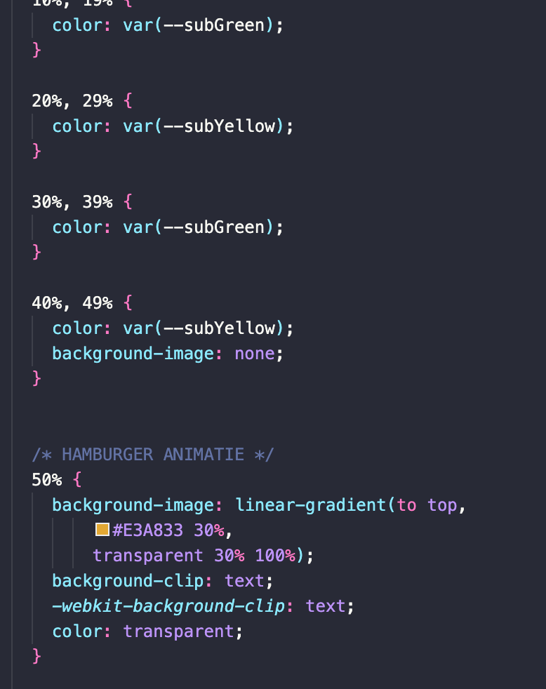
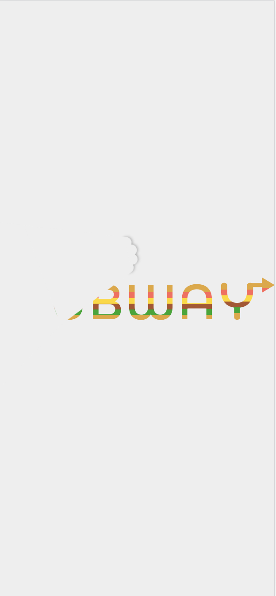
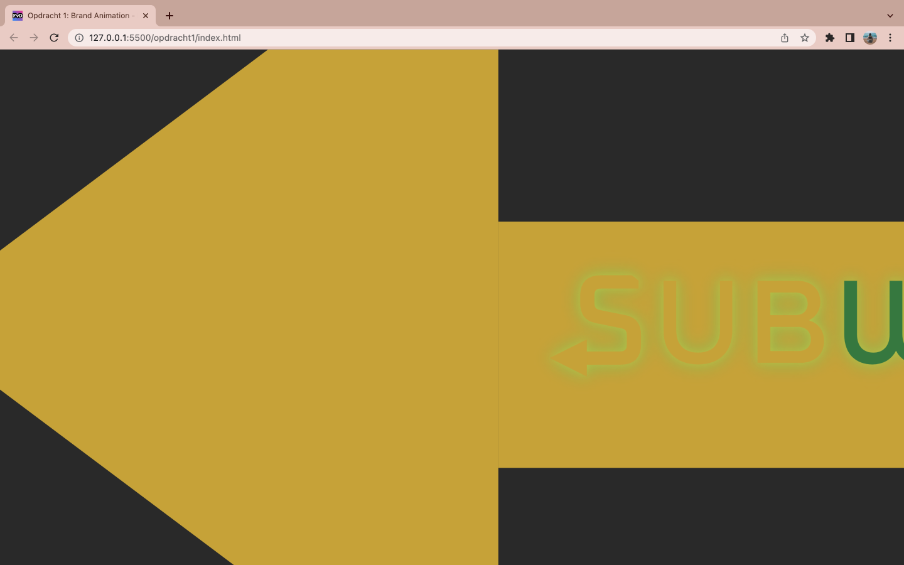

# Procesverslag
**Auteur:** Shae Drost

**De opdrachten:** [opdracht 1](opdracht1/index.html) en [opdracht 2](opdracht2/index.html)

Markdown is een simpele manier om HTML te schrijven.  
Markdown cheat cheet: [Hulp bij het schrijven van Markdown](https://github.com/adam-p/markdown-here/wiki/Markdown-Cheatsheet).

Nb. De standaardstructuur en de spartaanse opmaak van de README.md zijn helemaal prima. Het gaat om de inhoud van je procesverslag. Besteedt de tijd voor pracht en praal aan je website.

Nb. Door *open* toe te voegen aan een *details* element kun je deze standaard open zetten. Fijn om dat steeds voor de relevante stuk(ken) te doen.

## Bronnenlijst
  1. https://stackoverflow.com/questions/9131026/how-to-keep-styles-after-animation
  2. https://bennettfeely.com/clippy/
  3. Sanne

## Opdracht 1 plan

  
uitwerken na schetsen idee (voor week 2)

  ### Je storyboard:
  

  ### Je ambitie: 
  Aan deze technieken/punten wil ik werken:
  - CSS transitie
  - CSS animation posibilities
  - Nette CSS keyframes schrijven
  - ...
 

## Opdracht 1 reflectie

  
uitwerken bij afronden opdracht (voor week 4)

  ### Je uitkomst - karakteristiek screenshot(s):
  

  ### Dit ging goed/Heb ik geleerd: 
  Korte omschrijving met plaatje(s)

  Ik heb de font-size: clamp(); geleerd, dit is zeer nuttig en kende ik hiervoor nog niet.

  Ik heb geleerd dat in een keyframe, een background-image later in de keyframe wordt gehalveerd in de transitie
  als deze daarvoor niet op none is gezet. Ondanks dat ik dit op de harde manier heb moeten leren, was dit  
  zeer nuttige kennis.

  
  Ik heb geleerd + veel kunnen oefenen met de VAN-TOT percentages, bij zowel de keyframes zelf als bij de lineair-gradient.

  Ik ben natuurlijk super blij en trots op de oplevering. Dus dat is het grootste pluspunt! Super leuke opdracht.

  ### Dit was lastig/Is niet gelukt:
  Korte omschrijving met plaatje(s)

  
  Het is me alleen nog niet gelukt om het happertje ook juist responsive te krijgen voor mobile.

  
  En wat alleen opvalt bij darkmode, is dan de eerste animatie met de arrow, achter de tekst staat.
  Dus in een flitsseconde kun je wel zien dat de tekst voor de arrow staat. Ter perfectie had ik hem
  natuurlijk erachter willen hebben.

  En als laatste, hier had ik geen tijd meer voor en reikte mijn kennis nog niet naar. Ik had geen tijd om dit nog te leren
  en te typen. Maar ik wilde eigenlijk nog de letters een beetje uitrekken en weer naar default zodra ze in het scherm zijn 
  getrokken door de arrow bij de eerste animatie. 
  Nu heb ik super veel andere toffe dingen en is het een detail, maar alleen die miste ik dan nog. Maar ik snapte de scale3D
  of iets dergelijks niet in 1 oogopslag. vandaar.

## Opdracht 2 plan

  
uitwerken na schetsen idee (voor week 5)

  ### Je ontwerp:
  

  ### Je ambitie: 
  Aan deze technieken/punten wil ik werken:
  - punt 1
  - punt 2
  - nog een punt
  - ...

## Opdracht 2 test

  
uitwerken na testen (week 7)

  Neem minimaal 5 bevindingen op:

  ### Bevinding 1:
  Omschrijving van wat er nog niet orde was (tekst en afbeeding(en)).

  #### oplossing:
  Beschrijving hoe je het hebt hebt opgelost of als het niet gelukt is hoe je het zou oplossen (tekst en afbeeding(en)).

  ### Bevinding 2:
  Omschrijving van wat er nog niet orde was (tekst en afbeeding(en)).

  #### oplossing:
  Beschrijving hoe je het hebt hebt opgelost of als het niet gelukt is hoe je het zou oplossen (tekst en afbeeding(en)).

  ### Bevinding 3:
  ...

## Opdracht 2 reflectie

  
uitwerken bij afronden opdracht (voor week 8)

  ### Je uitkomst - karakteristiek screenshot(s):
  

  ### Dit ging goed/Heb ik geleerd: 
  Korte omschrijving met plaatje(s)

  

  ### Dit was lastig/Is niet gelukt:
  Korte omschrijving met plaatje(s)

  

